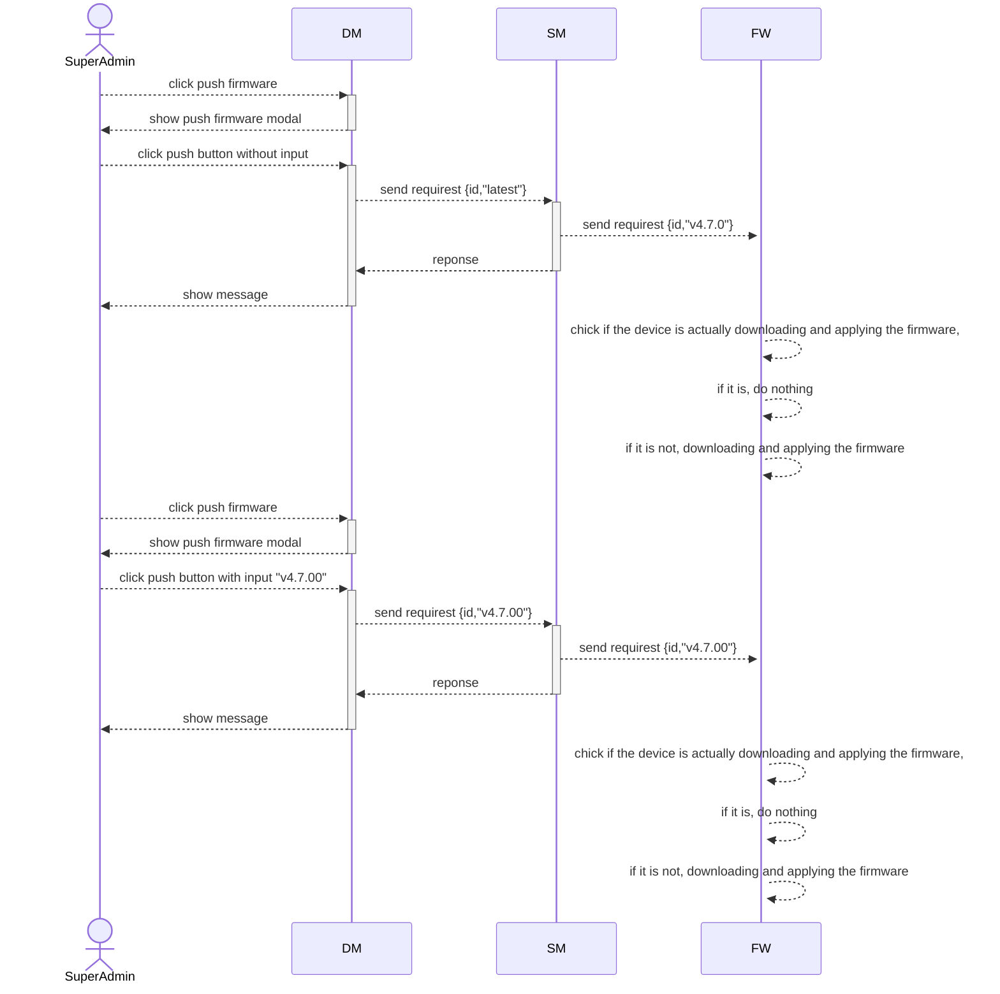

# diagram for Push firmware

```mermaid
sequenceDiagram


actor sa as SuperAdmin
participant dm as DM
participant sm as SM
participant fw as FW

sa-->>+dm: click push firmware
dm-->>-sa: show push firmware modal

sa-->>+dm: click push button without input 
dm-->>+sm: send requirest {id,"latest"}
sm-->>+fw: send requirest {id,"v4.7.0"}
sm-->>-dm: reponse
dm-->>-sa: show message
fw-->>fw: chick if the device is actually downloading and applying the firmware, 
fw-->>fw: if it is, do nothing
fw-->>fw: if it is not, downloading and applying the firmware


sa-->>+dm: click push firmware
dm-->>-sa: show push firmware modal

sa-->>+dm: click push button with input "v4.7.00"
dm-->>+sm: send requirest {id,"v4.7.00"}
sm-->>+fw: send requirest {id,"v4.7.00"}
sm-->>-dm: reponse
dm-->>-sa: show message
fw-->>fw: chick if the device is actually downloading and applying the firmware, 
fw-->>fw: if it is, do nothing
fw-->>fw: if it is not, downloading and applying the firmware

```

